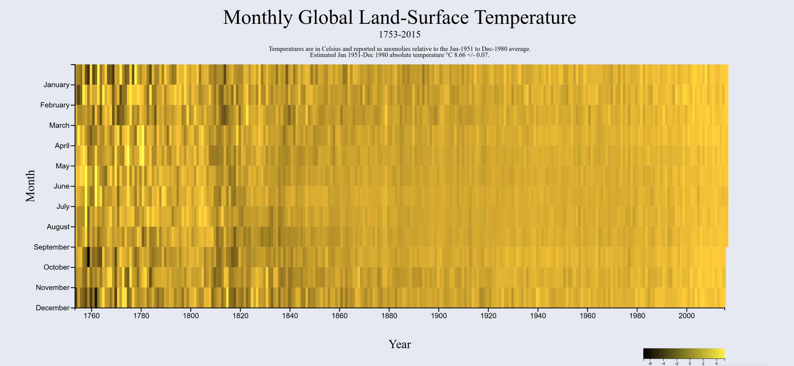

# D3-Scatterplot
using d3.js to create barchart used dataset for Gross Domestic Product by quarter from 1947-2015 in Billions. Created Tooltip that tracks mouse, highlighting.

try it on [Codepen](https://codepen.io/Cyberputty/full/vRarVX/)!
